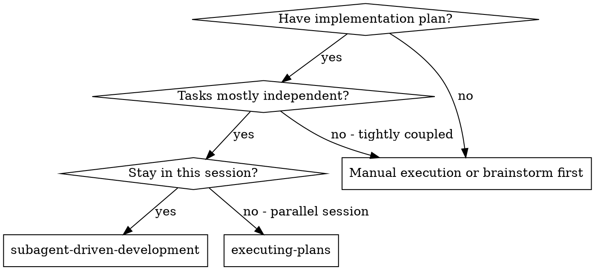
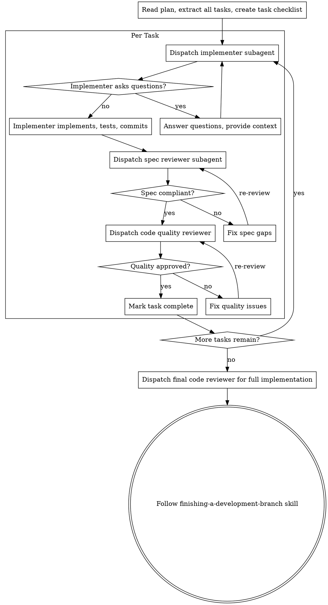

# Subagent-Driven Development

Execute a plan by dispatching a fresh subagent per task, with two-stage review after each: spec compliance review first, then code quality review.

**Why subagents:** You delegate tasks to specialized agents with isolated context. By precisely crafting their instructions and context, you ensure they stay focused and succeed at their task. They should never inherit your session's context or history — you construct exactly what they need. This also preserves your own context for coordination work.

**Core principle:** Fresh subagent per task + two-stage review (spec then quality) = high quality, fast iteration

**Continuous execution:** Do not pause to check in with your human partner between tasks. Execute all tasks from the plan without stopping. The only reasons to stop are: BLOCKED status you cannot resolve, ambiguity that genuinely prevents progress, or all tasks complete.

## When to Use

## The Process

## Model Selection

Use the least powerful model that can handle each role to conserve cost and increase speed.

**Mechanical implementation tasks** (isolated functions, clear specs, 1-2 files): use a fast, cheap model.

**Integration and judgment tasks** (multi-file coordination, pattern matching, debugging): use a standard model.

**Architecture, design, and review tasks**: use the most capable available model.

## Handling Implementer Status

Implementer subagents report one of four statuses:

**DONE:** Proceed to spec compliance review.

**DONE_WITH_CONCERNS:** Read the concerns before proceeding. If about correctness or scope, address before review. If observations, note and proceed.

**NEEDS_CONTEXT:** Provide the missing context and re-dispatch.

**BLOCKED:** Assess the blocker:
1. Context problem → provide more context and re-dispatch
2. Requires more reasoning → re-dispatch with more capable model
3. Task too large → break into smaller pieces
4. Plan is wrong → escalate to the human

**Never** ignore an escalation or force the same model to retry without changes.

## Dispatching Implementer Subagents

Each implementer subagent needs:
- Full task text from the plan (don't make them read the plan file)
- Brief scene-setting context (what was built before this task)
- Clear instructions to follow the test-driven-development skill
- Expected output format (DONE / DONE_WITH_CONCERNS / NEEDS_CONTEXT / BLOCKED)

Each spec reviewer subagent needs:
- The task requirements
- Git diff of what was implemented
- Pass/fail verdict on spec compliance

Each code quality reviewer subagent needs:
- Brief description of what was built
- Git SHA range
- Categorized feedback: Critical / Important / Minor / Strengths

See the requesting-code-review skill and its `code-reviewer.md` template for the reviewer prompt.

## Red Flags

**Never:**
- Start implementation on main/master branch without explicit user consent
- Skip reviews (spec compliance OR code quality)
- Proceed with unfixed issues
- Dispatch multiple implementation subagents in parallel (conflicts)
- Make subagent read plan file (provide full text instead)
- Accept "close enough" on spec compliance
- **Start code quality review before spec compliance is approved**
- Move to next task while either review has open issues

**If subagent asks questions:** Answer clearly and completely before letting them proceed.

**If reviewer finds issues:** Implementer fixes → reviewer re-reviews → repeat until approved.

## Integration

**Related skills:**
- **using-git-worktrees** — Ensures isolated workspace
- **writing-plans** — Creates the plan this skill executes
- **requesting-code-review** — Code review template for reviewer subagents
- **finishing-a-development-branch** — Complete development after all tasks
- **test-driven-development** — Subagents should follow TDD for each task
- **executing-plans** — Alternative for non-subagent execution
